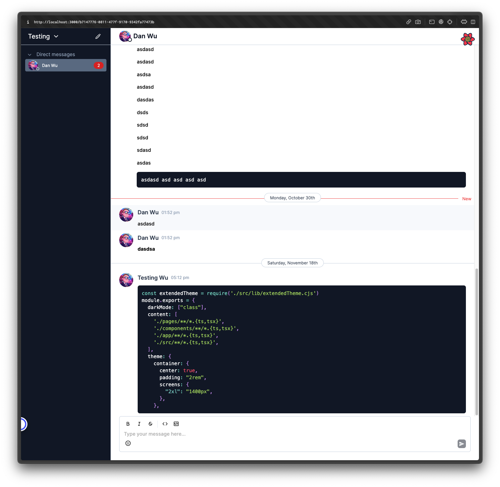

# Rich text editor and performance optimisation for chat applications POC

This is a small POC for optimising chat applications through virtualisation techniques, effective state management
and implementing rich text editor modelled after Slack. Real time events is handled by Ably and LiveBlocks while
authentication is handled by Clerk third party services.

</img>